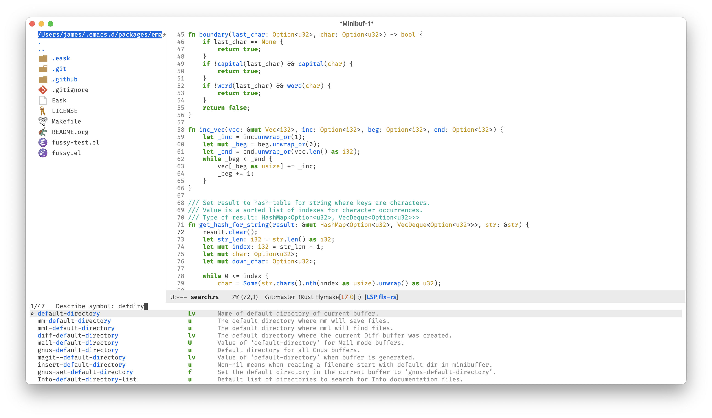

#+TITLE: Fussy
#+STARTUP: noindent

[[https://github.com/jojojames/fussy/actions/workflows/build.yaml][file:https://github.com/jojojames/fussy/actions/workflows/build.yaml/badge.svg]]
[[https://melpa.org/#/fussy][file:https://melpa.org/packages/fussy-badge.svg]]
[[https://stable.melpa.org/#/fussy][file:https://stable.melpa.org/packages/fussy-badge.svg]]

This is a package to provide a ~completion-style~ to Emacs that is able to
leverage [[https://github.com/lewang/flx][flx]] as well as various other
libraries such as [[https://github.com/dangduc/fzf-native][fzf-native]]
to provide intelligent scoring and sorting.

This package is intended to be used with packages that leverage
~completion-styles~, e.g. ~completing-read~ and ~completion-at-point-functions~.

It is usable with ~icomplete~ (as well as ~fido-mode~), ~selectrum~,
~vertico~, ~corfu~, ~helm~, ~company-mode~ and ~ivy~.

It is not currently usable with ~ido~ which doesn't support
~completion-styles~ and has its own sorting and filtering system.
~ivy~ support is provided through an advice on its internal sorting.
* Installation
: M-x package-install RET fussy RET
Or clone / download this repository and modify your ~load-path~:

#+begin_src emacs-lisp :tangle yes
  (add-to-list 'load-path (expand-file-name "/path/to/fussy/" user-emacs-directory))
#+end_src
** Emacs -Q example
#+begin_src emacs-lisp :tangle yes
  (add-to-list 'package-archives '("melpa" . "https://melpa.org/packages/"))
  (require 'package)
  (package-initialize)
  (package-refresh-contents)

  (unless (package-installed-p 'fussy)
    (package-install 'fussy))
  (fussy-setup)
#+end_src
** Use-Package Example
#+begin_src emacs-lisp :tangle yes
  ;; `flx`
  (use-package fussy
    :ensure t
    :config
    (fussy-setup))
#+end_src

or

#+begin_src emacs-lisp :tangle yes
  ;; `fzf`
  (use-package fzf-native
    :vc (:url "https://github.com/dangduc/fzf-native" :rev :newest))

  (use-package fussy
    :config
    (fussy-setup-fzf)
    (fussy-eglot-setup)
    (fussy-company-setup))
#+end_src

* Scoring Backends
~fussy~ defaults to [[https://github.com/lewang/flx][flx]] for scoring matches
but it has the most integration with [[https://github.com/dangduc/fzf-native][fzf-native]].

Additional (listed below) scoring libraries can also be used.
** Flx
[[https://github.com/lewang/flx][flx]] is a dependency of ~fussy~ and the default
scoring algorithm.

~flx~ has a great scoring algorithm but is one of the slower implementations
compared to the other scoring backends written as native modules.
** Flx-rs
[[https://github.com/jcs-elpa/flx-rs][flx-rs]] is a native module written in Rust
that matches the original ~flx~ scoring algorithm. It is about 10 times faster
than the original implementation written in Emacs Lisp. We can use this package
instead for extra performance with the same scoring strategy.

One downside of this package is that it doesn't yet support using ~flx~'s file
cache so filename matching is currently slightly worse than the original Emacs
lisp implementation.

#+begin_src emacs-lisp :tangle yes
  (use-package flx-rs
    :ensure t
    :straight
    (flx-rs
     :repo "jcs-elpa/flx-rs"
     :fetcher github
     :files (:defaults "bin"))
    :config
    (setq fussy-score-fn 'fussy-flx-rs-score)
    (flx-rs-load-dyn))
#+end_src
** Fzf-Native
Use [[https://github.com/dangduc/fzf-native][fzf-native]] for scoring.

Provides fuzzy matching scoring based on the ~fzf~ algorithm (by
[[https://github.com/junegunn][junegunn]]) through a dynamic module
for a native C implementation of ~fzf~,
[[https://github.com/nvim-telescope/telescope-fzf-native.nvim][telescope-fzf-native.nvim]].

#+begin_src emacs-lisp :tangle yes
(use-package fzf-native
  :vc (:url "https://github.com/dangduc/fzf-native" :rev :newest))
#+end_src

NOTE: You can use non-fuzzy matching with ~fzf-native~ by configuring:
~fussy-fzf-fuzzy~, which controls whether terms in queries are matched
fuzzily or as exact substrings.  Propagated to ~fzf-native-fuzzy~ via
~setq-local~ inside ~fussy-all-completions-v1~; only meaningful when
~fussy-score-ALL-fn~ is ~fussy-fzf-score~.

| Value | Behavior                                                                |
|-------+-------------------------------------------------------------------------|
| ~t~   | Fuzzy matching (default).  Prefix a term with ~'~ to force exact match. |
| ~nil~ | Exact/substring matching.  Prefix a term with ~'~ to force fuzzy match. |

Operator filters (~!~, ~^~, ~$~, ~|~, space-separated AND terms) work
identically regardless of this setting — ~fussy-fzf-fuzzy~ only changes
the default matcher used for bare terms.

#+begin_src emacs-lisp :tangle yes
  (setq fussy-fzf-fuzzy t)   ; default
  (setq fussy-fzf-fuzzy nil) ; exact/substring matching
#+end_src

** Fuz
Another option is to use the [[https://github.com/rustify-emacs/fuz.el][fuz]]
library (also in Rust) for scoring.

This library has two fuzzy matching algorithms, ~skim~ and ~clangd~.

Skim: Just like [[https://github.com/junegunn/fzf][fzf]] v2, the algorithm is
based on Smith-Waterman algorithm which is normally used in DNA sequence alignment

Clangd: The algorithm is based on clangd's
[[https://github.com/MaskRay/ccls/blob/master/src/fuzzy_match.cc][FuzzyMatch.cpp]].

For more information: [[https://github.com/lotabout/fuzzy-matcher][fuzzy-matcher]]

#+begin_src emacs-lisp :tangle yes
  (use-package fuz
    :ensure nil
    :straight (fuz :type git :host github :repo "rustify-emacs/fuz.el")
    :config
    (setq fussy-score-fn 'fussy-fuz-score)
    (unless (require 'fuz-core nil t)
      (fuz-build-and-load-dymod)))
#+end_src

For batch scoring using Rust/rayon parallelism, use ~fussy-fuz-score-all~ instead.
It calls ~fuz-score-all-skim~ or ~fuz-score-all-clangd~ to score the entire
candidate collection in a single call.

#+begin_src emacs-lisp :tangle yes
  (use-package fuz
    :ensure nil
    :straight (fuz :type git :host github :repo "rustify-emacs/fuz.el")
    :config
    (setq fussy-score-fn 'fussy-fuz-score-all)
    (unless (require 'fuz-core nil t)
      (fuz-build-and-load-dymod)))
#+end_src

#+begin_src emacs-lisp :tangle yes
  ;; Same as fuz but with prebuilt binaries.
  (use-package fuz-bin
    :ensure t
    :straight
    (fuz-bin
     :repo "jcs-elpa/fuz-bin"
     :fetcher github
     :files (:defaults "bin"))
    :config
    (setq fussy-score-fn 'fussy-fuz-bin-score)
    (fuz-bin-load-dyn))
#+end_src
** Liquid Metal
This is the algorithm used by the old [[https://www.emacswiki.org/emacs/lusty-explorer.el][lusty-explorer]].

A mimetic poly-alloy of the Quicksilver scoring algorithm,
essentially LiquidMetal.

Flex matching short abbreviations against longer strings is a boon in
productivity for typists.  Applications like Quicksilver, Alfred, LaunchBar, and
Launchy have made this method of keyboard entry a popular one. It's time to
bring this same functionality to web controls. LiquidMetal makes scoring long
strings against abbreviations easy.

For more information: [[https://github.com/rmm5t/liquidmetal][liquidmetal]]

#+begin_src emacs-lisp :tangle yes
  (use-package liquidmetal
    :ensure t
    :straight t
    :config
    (setq fussy-score-fn 'fussy-liquidmetal-score))
#+end_src

** Sublime-Fuzzy
Fuzzy matching algorithm based on Sublime Text's string search.
Iterates through characters of a search string and calculates a score.
This is another fuzzy implementation written in Rust.

For more information: [[https://github.com/Schlechtwetterfront/fuzzy-rs][fuzzy-rs]]

#+begin_src emacs-lisp :tangle yes
  (use-package sublime-fuzzy
    :ensure t
    :straight
    (sublime-fuzzy
     :repo "jcs-elpa/sublime-fuzzy"
     :fetcher github
     :files (:defaults "bin"))
    :config
    (setq fussy-score-fn 'fussy-sublime-fuzzy-score)
    (sublime-fuzzy-load-dyn))
#+end_src
** Hotfuzz
This is a fuzzy Emacs completion style similar to the built-in flex style, but
with a better scoring algorithm. Specifically, it is non-greedy and ranks
completions that match at word; path component; or camelCase boundaries higher.

For more information: [[https://github.com/axelf4/hotfuzz][hotfuzz]]

Note, ~hotfuzz~ has its own ~completion-style~ that may be worth using over this one.

#+begin_src emacs-lisp :tangle yes
  (use-package hotfuzz
    :ensure t
    :straight t
    :config
    (setq fussy-score-fn 'fussy-hotfuzz-score))
#+end_src
* Recommendations
~fussy~ is written to be configure-less by the user. For defaults, it uses the
built-in ~flex~ algorithm for filtering and ~flx~ for scoring and sorting.

However, users are encouraged to try the various available scoring backends.
These scoring backends are configured through ~fussy-score-fn~. See its docstring
for configuration.

For improved performance, use a scoring backend backed by a native module.
Examples include but are not limited to:

- ~fzf-native~ [RECOMMENDED]
- ~flx-rs~
- ~fuz/fuz-bin~

~flx-rs~ will provide an algorithm that matches the original ~flx~ algorithm
while the other two matches other popular packages (~skim~ and ~fzf~).

Below is a sample config that uses ~flx-rs~ for improved performance.

~fuz-bin~ or ~fuz~ may be a better choice for performance than ~flx-rs~ but uses
a different algorithm.

#+begin_src emacs-lisp :tangle yes
  (use-package flx-rs
    :ensure t
    :straight
    (flx-rs
     :repo "jcs-elpa/flx-rs"
     :fetcher github
     :files (:defaults "bin"))
    :config
    (setq fussy-score-fn 'fussy-flx-rs-score)
    (flx-rs-load-dyn))

  (use-package fussy
    :ensure t
    :straight
    (fussy :type git :host github :repo "jojojames/fussy")
    :config
    (setq fussy-score-fn 'fussy-flx-rs-score)
    (fussy-setup)
    (fussy-eglot-setup)
    (fussy-company-setup))
#+end_src

For the most performant option, use [[https://github.com/dangduc/fzf-native][fzf-native]]
and see my configuration for an example. See Benchmarking below for basic runs.
* My Configuration
Documenting my configuration for the users that may want to copy. Unlike the
former configuration, this section will be kept up to date with my ~init.el~.

#+begin_src emacs-lisp :tangle yes
(use-package fzf-native
  :vc (:url "https://github.com/dangduc/fzf-native" :rev :newest))

(use-package fussy
  :vc (:url "https://github.com/jojojames/fussy" :rev :newest)
  :config
  (setq fussy-compare-same-score-fn 'fussy-histlen->strlen<)
  (fussy-setup-fzf)
  (fussy-eglot-setup)
  (fussy-company-setup))
#+end_src
* Scoring Samples
Listed below are samples of scores that backends return given a candidate string and a search string to match against it.
This may help in determining a preferred scoring backend.
** Flx
#+begin_src emacs-lisp :tangle yes
(flx-score "Makefile" "mkfile")
(281 0 2 4 5 6 7)
(flx-score "fork/yasnippet-snippets/snippets/chef-mode/cookbook_file" "mkfile")
(222 38 46 52 53 54 55)
#+end_src
** Fuz
#+begin_src emacs-lisp :tangle yes
  ;; candidate: Makefile query: mkfile score 77
  ;; candidate: fork/yasnippet-snippets/snippets/chef-mode/cookbook_file query: mkfile score 68
#+end_src
** Fzf
#+begin_src emacs-lisp :tangle yes
  ;; candidate: Makefile query: mkfile 118
  ;; candidate: fork/yasnippet-snippets/snippets/chef-mode/cookbook_file query: mkfile 128
#+end_src

* Filtering Choices
Before scoring and sorting candidates, we must somehow filter them from the
completion table. The approaches below are several ways to do that, each with
varying advantages and disadvantages.
** Scoring
This filtering method uses the configured ~fussy-score-fn~ (or ~fussy-score-ALL-fn~)
to filter candidates. This ensures that filtering is 1:1 with scoring, allowing
for advanced pattern matching features specific to each backend to be used during
the filtering phase. e.g. https://github.com/junegunn/fzf#search-syntax

#+begin_src emacs-lisp :tangle yes
  (setq fussy-filter-fn 'fussy-filter-by-scoring)
#+end_src

** Flex
This is the default filtering method and is 1:1 to the filtering done
when using the ~flex~ ~completion-style~. Advantages are no additional
dependencies and likely bug-free/stable to use.

The only disadvantage is that it's the slowest of the filtering methods.

#+begin_src emacs-lisp :tangle yes

  ;; Flex
  (setq fussy-filter-fn 'fussy-filter-flex)
#+end_src

** Fast
This is another usable filtering method and leverages the ~all-completions~ API
written in C to do its filtering. It seems to be the fastest of the filtering
methods from quick benchmarking as well as requiring no additional dependencies.

Implementation may be buggy though, so use with caution.

#+begin_src emacs-lisp :tangle yes
  ;; Fast
  (setq fussy-filter-fn 'fussy-filter-default)
#+end_src
* Caching
Results and filtering can be cached for improved performance by setting
~fussy-use-cache~ to t.

With this set to t:

If user already entered the same query:

e.g. User types "a" -> "ab" and then backspaces into "a" again.

Results from the originally entered "a" will be used for the second entered "a".

If user is entering a new query but there exists results from a previous query
in the cache:

e.g. User types "a" and then "ab". Results from "a" will then be used for
filtering in "ab".
* Benchmarking
  On a Macbook Air M5.
#+begin_src emacs-lisp :tangle yes
  (setq random-col (all-completions "" 'help--symbol-completion-table nil))

  (benchmark-run 10 (dolist (x random-col)
                      (flx-score x "a")))
  (4.52991 29 1.269130000000004)

   ;; Handles entire list at once.
  (benchmark-run 10 (fussy-fzf-score random-col "a"))
  (0.123468 0 0.0)
#+end_src

Using https://github.com/jojojames/emacs-completion-bench

| Style                                                            | Time (s) | #GC | GC time (s) |   Rel |
|------------------------------------------------------------------+----------+-----+-------------+-------|
| `basic`                                                          | 0.054805 |   0 |         0.0 |  0.47 |
| `fussy`/`fzf-native` (filter-only, `fussy-filter-default`)       | 0.090381 |   0 |         0.0 |  0.78 |
| `fussy`/`fzf-native` (filter-only, `fussy-filter-by-scoring`)    | 0.094981 |   0 |         0.0 |  0.82 |
| `fussy`/`fzf-native` (`fussy-filter-default`)                    | 0.096279 |   0 |         0.0 |  0.83 |
| `fussy`/`fzf-native` (`fussy-filter-by-scoring`)                 | 0.105952 |   0 |         0.0 |  0.91 |
| `hotfuzz`                                                        | 0.115911 |   0 |         0.0 |     1 |
| `orderless` (default)                                            | 0.306053 |   0 |         0.0 |  2.64 |
| `fussy`/`fuz-bin`                                                | 0.432805 |   0 |         0.0 |  3.73 |
| `substring`                                                      | 0.772593 |   0 |         0.0 |  6.67 |
| `orderless` (flex)                                               | 0.841234 |   0 |         0.0 |  7.26 |
| `fussy`/`flx`                                                    | 0.910818 |   2 |    0.134576 |  7.86 |
| `flex`                                                           | 2.183582 |   0 |         0.0 | 18.84 |
| `fussy`/`flx-rs`                                                 | 3.995279 |   0 |         0.0 | 34.47 |

The =filter-only= rows are taken with =fussy-company-filter-only-length=
set to a positive integer (opt-in) — fzf-native runs its cheap
~fzf_has_match~ path instead of full DP scoring, and ~fussy~ stays in
the completion pipeline so its candidate pool subsumes across
keystrokes.  At 95k candidates the absolute win over full scoring is
modest (~6–10%); it widens with pool size because the per-candidate
inner loop is ~5× cheaper.

* Integrations
** Eglot Integration
#+begin_src emacs-lisp :tangle yes
  (fussy-eglot-setup)
#+end_src

** Company Integration
Call ~fussy-company-setup~. This function advises a few ~company-mode~ functions.
#+begin_src emacs-lisp :tangle yes
  (fussy-company-setup)
#+end_src

Two knobs control how fussy handles short prefixes under company:

| Variable                            | Default | Behavior                                                                 |
|-------------------------------------+---------+--------------------------------------------------------------------------|
| ~fussy-company-prefix-length~       | 0       | Bypass cutoff: prefixes strictly shorter than N strip fussy from ~completion-styles~ and run plain completion. Default ~0~ disables the bypass. |
| ~fussy-company-filter-only-length~  | nil     | Filter-only cutoff: when set to a positive integer N, prefixes strictly shorter than N keep fussy in the pipeline but take fzf-native's cheap ~fzf_has_match~ path.  Overrides the bypass when both apply.  Only meaningful when ~fussy-score-ALL-fn~ is ~fussy-fzf-score~. |

By default neither cutoff fires — fussy runs its full scoring
pipeline for every prefix.

To opt in to the filter-only path (`fzf` route) for short prefixes,
set ~fussy-company-filter-only-length~ to a small integer (e.g. 3):
~fzf-native~ does the cheap filtering, fussy stays in
~completion-styles~ so its candidate pool subsumes naturally across
keystrokes, and the eventual full-scoring keystroke (prefix length ≥
N) scans an already-narrow set.

#+begin_src emacs-lisp
(setq fussy-company-filter-only-length 3)
#+end_src

To opt in to the bypass path instead — short prefixes skip fussy
entirely, falling back to plain ~completion-styles~ — set:
#+begin_src emacs-lisp
(setq fussy-company-prefix-length 3)
#+end_src
** Icomplete/Fido Integration
~fido~ uses the built in ~flex~ ~completion-style~ by default. We can advise
~icomplete~'s setup hook to set up ~fussy~ with ~fido-mode~.

#+begin_src emacs-lisp :tangle yes
  (use-package icomplete
    :ensure nil
    :straight nil
    :config
    (defun fussy-fido-setup ()
      "Use `fussy' with `fido-mode'."
      (setq-local completion-styles '(fussy basic)))
    (advice-add 'icomplete--fido-mode-setup :after 'fussy-fido-setup)
    (setq icomplete-tidy-shadowed-file-names t
          icomplete-show-matches-on-no-input t
          icomplete-compute-delay 0
          icomplete-delay-completions-threshold 50)
    ;; Or `fido-mode'.
    (fido-vertical-mode))
#+end_src
** Corfu Integration
#+begin_src emacs-lisp :tangle yes
  (fussy-corfu-setup)
#+end_src
** Helm Integration
Integration with [[https://github.com/emacs-helm/helm][helm]] is possible by
setting ~helm-completion-style~ to ~emacs~ instead of ~helm~.

#+begin_src emacs-lisp :tangle yes
  (setq helm-completion-style 'emacs)
#+end_src

For more information:
https://github.com/emacs-helm/helm/blob/master/helm-mode.el#L269

** Ivy Integration
Since ~ivy~ doesn't support ~completion-styles~, we have to hack ~fussy~ into it.
We can use ~fussy-ivy-setup~ which advises ~ivy--flx-sort~ and replaces it with
an optimized version that uses ~fussy~'s batch-scoring backends.
We also override ~ivy--re-filter~ to control filtering.

#+begin_src emacs-lisp :tangle yes
  (fussy-ivy-setup)
#+end_src

For more information: https://github.com/abo-abo/swiper/issues/848#issuecomment-1143129670

* fzfa
[[https://github.com/jojojames/fzfa][fzfa]] is the companion sibling project to ~fussy~. Where ~fussy~
is a synchronous ~completion-style~ that works inside Emacs's standard
completion machinery (=completing-read=, =completion-at-point=, etc.),
~fzfa~ takes a different approach: it streams candidates from
long-running shell commands (=find=, =rg=, =git ls-files=, …) and scores
them asynchronously, bypassing ~fussy~'s pipeline entirely via its own
completion category.

Both packages sit on top of [[https://github.com/dangduc/fzf-native][fzf-native]], which provides the shared
C scoring engine:

#+begin_src
  ┌──────────────────┐    ┌────────────────────────────────┐
  │ fussy            │    │ fzfa                      │
  │  sync, in-memory │    │  async, shell-streaming        │
  │  completion-style│    │  own completion category       │
  └────────┬─────────┘    └─────────────────┬──────────────┘
           │                                │
           │ fzf-native-score-all           │ fzf-native-async-*
           │ (sync batch)                   │ (async streaming)
           ▼                                ▼
  ╔══════════════════════════════════════════════════════════╗
  ║ fzf-native (C dynamic module)                            ║
  ║   sync scoring + async reader/scorer threads             ║
  ╚══════════════════════════════════════════════════════════╝
#+end_src

Use ~fussy~ when you want fuzzy scoring layered over standard Emacs
completion (=M-x=, =find-file=, =completion-at-point=, and similar). Use
~fzfa~ when you want to stream results from an external tool like
=find= or =rg= — searches where candidates arrive incrementally as a
child process runs.

* Architecture

For a deep dive into how ~fussy~ works internally — the
~all-completions~ pipeline, filter / score / sort stages, pluggable
backend dispatch, caching and special-token invalidation — see
[[file:architecture.org][architecture.org]].

The three sibling projects each have their own architecture reference:

- [[file:architecture.org][fussy/architecture.org]] (this file) — the completion-style
  pipeline: filter → score → sort → highlight.
- [[https://github.com/dangduc/fzf-native/blob/HEAD/architecture.org][fzf-native/architecture.org]] — the C dynamic module underneath.
  Covers sync single-candidate scoring, sync batch scoring (parallel
  workers + counting sort), and the async streaming pipeline
  (reader/scorer threads, arena allocator, LRU result cache).
- [[https://github.com/jojojames/fzfa/blob/HEAD/architecture.org][fzfa/architecture.org]] — the companion sibling project.
  Explains the async completing-read UX built on ~fzf-native~'s
  streaming surface, the timer model, the passthrough completion style,
  and why ~fzfa~ deliberately routes around ~fussy~ via its own
  completion category.

* Contributing
Set up ~eask~.
#+begin_src sh :tangle yes
  $ brew install node
  $ npm install -g @emacs-eask/eask
#+end_src
#+begin_src emacs-lisp :tangle yes
  make test
#+end_src
* Discussions
https://github.com/lewang/flx/issues/54
https://github.com/company-mode/company-mode/issues/47
https://github.com/abo-abo/swiper/issues/207
https://github.com/abo-abo/swiper/issues/2321
https://github.com/abo-abo/swiper/issues/848
https://github.com/melpa/melpa/pull/8029
https://github.com/emacs-helm/helm/issues/2165
